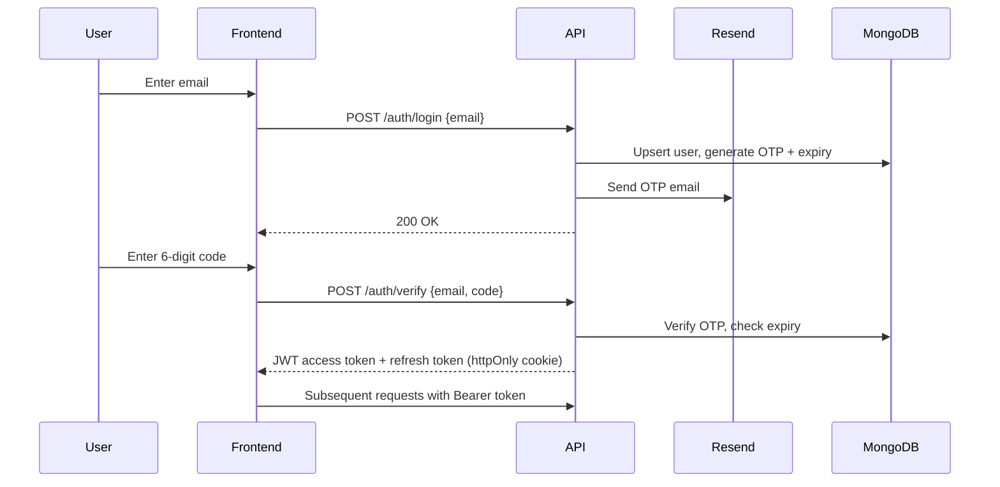
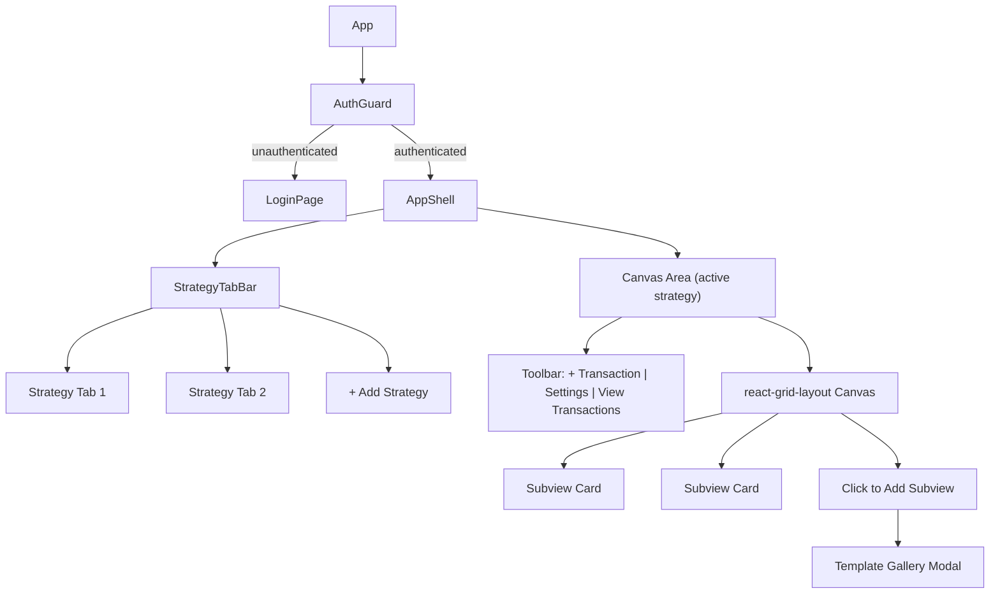
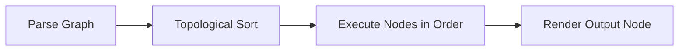

# Strategy-First Investment Tracking App -- Full Implementation Plan

## Monorepo Structure

```
Str/
├── packages/
│   └── shared/                  # Shared TypeScript types, enums, constants
│       ├── src/
│       │   ├── models/          # User, Strategy, Transaction, Instrument, Wallet, Subview types
│       │   ├── enums/           # TransactionType, AssetType, CacheStatus, etc.
│       │   ├── dto/             # Request/response DTOs shared between FE/BE
│       │   └── pipeline/        # Pipeline node type definitions
│       ├── package.json
│       └── tsconfig.json
├── apps/
│   ├── web/                     # Vite + React + TypeScript
│   │   ├── src/
│   │   │   ├── api/             # API client (axios + TanStack Query hooks)
│   │   │   ├── components/      # Shared UI components
│   │   │   ├── features/
│   │   │   │   ├── auth/        # Login, OTP verification pages
│   │   │   │   ├── strategy/    # Tab bar, strategy settings
│   │   │   │   ├── canvas/      # react-grid-layout canvas, subview cards
│   │   │   │   ├── pipeline/    # React Flow node editor
│   │   │   │   ├── transactions/# Transaction list, add/edit forms
│   │   │   │   └── subviews/    # Chart renderers, gallery, templates
│   │   │   ├── hooks/           # Custom hooks (useAuth, useStrategy, useCurrency)
│   │   │   ├── store/           # Zustand stores (auth, strategies, UI state)
│   │   │   ├── lib/             # Pipeline executor, currency converter, utils
│   │   │   └── App.tsx
│   │   ├── package.json
│   │   ├── vite.config.ts
│   │   └── tsconfig.json
│   └── api/                     # NestJS backend
│       ├── src/
│       │   ├── auth/            # AuthModule: OTP generation, verification, JWT
│       │   ├── users/           # UserModule: CRUD, subscription status
│       │   ├── strategies/      # StrategyModule: CRUD, subview management
│       │   ├── transactions/    # TransactionModule: CRUD, version bumping
│       │   ├── instruments/     # InstrumentModule: CRUD, lookup
│       │   ├── wallets/         # WalletModule: CRUD per strategy
│       │   ├── market-data/     # MarketDataModule: FMP proxy, in-memory cache
│       │   ├── common/          # Guards, interceptors, filters, decorators
│       │   └── main.ts
│       ├── package.json
│       ├── tsconfig.json
│       └── nest-cli.json
├── package.json                 # npm workspaces root
├── tsconfig.base.json           # Shared TS config
├── .env.example
├── run.sh                       # Single script to start both frontend + backend
└── README.md
```

Tool choices:

- **npm workspaces** for monorepo (simple, no extra tooling)
- **Zustand** for frontend state (lightweight, minimal boilerplate)
- **TanStack Query** for server state / data fetching
- **Recharts** for chart rendering (React-native, good variety of chart types)
- **Resend** for transactional email (modern API, great DX, free tier)
- **Mongoose** for MongoDB ODM

---

## 1. Project Scaffolding and Dev Environment

- Initialize npm workspaces root `package.json`
- Scaffold `apps/api` with NestJS CLI (`@nestjs/cli`)
- Scaffold `apps/web` with Vite React-TS template
- Create `packages/shared` with shared types
- Set up `tsconfig.base.json` with path aliases
- Create `run.sh` script that starts both backend and frontend dev servers concurrently (single command to launch everything)
- Create `.env.example` with all required env vars:
  - `MONGODB_URI`, `JWT_SECRET`, `RESEND_API_KEY`, `FMP_API_KEY`, `FRONTEND_URL`

---

## 2. Shared Types (packages/shared)

Core model interfaces and enums:

```typescript
// enums
enum TransactionType { BUY, SELL, SELL_SHORT, BUY_TO_COVER, DIVIDEND, DEPOSIT, WITHDRAWAL, FEE, INTEREST, OPTION_EXERCISE, OPTION_ASSIGN, OPTION_EXPIRE }
enum AssetType { STOCK, ETF, OPTION, BOND, CRYPTO, CASH, OTHER }
enum CacheStatus { VALID, INVALID }
enum SubscriptionStatus { FREE, ACTIVE, PAST_DUE, CANCELLED }

// Model interfaces: IUser, IStrategy, ISubview, ITransaction, IInstrument, IWallet
// Pipeline node types: SourceNode, FilterNode, GroupByNode, AggregateNode, CalculateNode, SortNode, OutputNode
// DTOs: CreateTransactionDto, UpdateStrategyDto, LoginDto, VerifyOtpDto, etc.
```

---

## 3. Authentication System

**Flow:**




**Backend implementation:**

- `AuthModule` with `AuthService`, `AuthController`
- OTP stored in User document: `{ otpCode, otpExpiresAt }` (expires in 10 min)
- Rate limiting: max 5 OTP requests per email per hour (use `@nestjs/throttler`)
- JWT strategy via `@nestjs/passport` + `passport-jwt`
- Access token (15 min) + Refresh token (7 days, httpOnly cookie)
- `JwtAuthGuard` applied globally, whitelist public routes with `@Public()` decorator

**Frontend:**

- Login page: email input -> OTP input (two-step form)
- Store access token in memory (Zustand), refresh token in httpOnly cookie
- Axios interceptor: auto-refresh on 401

---

## 4. Database Models (Mongoose Schemas)

**User:**

- `email` (unique, indexed), `subscriptionStatus`, `otpCode`, `otpExpiresAt`, `refreshToken`, `createdAt`

**Strategy:**

- `userId` (ref, indexed), `name`, `walletId` (ref), `customData` (Mixed/JSON), `transactionsVersion` (Number, default 0), `subviews` (embedded array of SubviewSchema), `createdAt`, `updatedAt`

**Subview (embedded in Strategy):**

- `id` (UUID), `name`, `position` ({x, y, w, h}), `pipeline` (Mixed -- serialized React Flow graph), `cacheData` (Mixed), `cachedAt`, `cacheVersion`, `cacheStatus` (enum: valid/invalid)

**Wallet:**

- `strategyId` (ref, unique, indexed), `baseCurrency`, `balance`, `margin`, `collateralValue`, `collateralMarginRequirement`

**Transaction:**

- `strategyId` (ref, indexed), `instrumentId` (ref), `type` (enum), `quantity`, `price`, `cashDelta`, `timestamp`, `metadata` (Mixed), `fee`, `optionData` (Mixed -- expiration, strike, etc.), `createdAt`
- Compound index: `{ strategyId: 1, timestamp: -1 }` for efficient queries

**Instrument:**

- `symbol` (indexed), `assetType` (enum), `currency`, `contractMetadata` (Mixed), `marginRequirement`, unique compound index on `{ symbol, assetType }`

---

## 5. Backend API Endpoints


| Module | Endpoints |
| ------ | --------- |


**Auth:**

- `POST /auth/login` -- send OTP
- `POST /auth/verify` -- verify OTP, return tokens
- `POST /auth/refresh` -- refresh access token
- `POST /auth/logout` -- clear refresh token

**Strategies:**

- `GET /strategies` -- list user's strategies
- `POST /strategies` -- create strategy
- `PATCH /strategies/:id` -- update name, customData
- `DELETE /strategies/:id` -- delete strategy + cascade transactions
- `PATCH /strategies/:id/subviews` -- update subview layout (batch position updates)
- `POST /strategies/:id/subviews` -- add subview
- `PATCH /strategies/:id/subviews/:subviewId` -- update subview pipeline/config
- `DELETE /strategies/:id/subviews/:subviewId` -- remove subview
- `PUT /strategies/:id/subviews/:subviewId/cache` -- save computed cache from frontend

**Transactions:**

- `GET /strategies/:id/transactions` -- list (paginated, sorted by timestamp desc)
- `POST /strategies/:id/transactions` -- add transaction (bumps `transactionsVersion`)
- `PATCH /transactions/:id` -- update transaction
- `DELETE /transactions/:id` -- delete transaction (bumps version)

**Instruments:**

- `GET /instruments/search?q=AAPL` -- search/autocomplete
- `GET /instruments/:id` -- get instrument details
- `POST /instruments` -- create (admin or auto-create on first transaction)

**Wallets:**

- `GET /strategies/:id/wallet` -- get wallet
- `PATCH /strategies/:id/wallet` -- update wallet settings

**Market Data:**

- `GET /market-data/quote/:symbol` -- real-time quote (proxied from FMP, cached in memory)
- `GET /market-data/history/:symbol` -- historical prices

---

## 6. Frontend -- Core Shell and Routing

The app has no dashboard page. The authenticated shell is simply a **tab bar** (strategies) with a **canvas area** as the tab content. Selecting a tab swaps the canvas.




**Layout (single page, no routing between strategies):**

- **Tab bar** across the top: shows all strategy tabs + "+" button to add a new strategy. No tabs initially -- empty state prompts user to create first strategy.
- **Canvas area** fills the rest of the viewport, showing the active strategy's content:
  - **Toolbar** (top-right of canvas): "+ Add Transaction" | Settings (gear) | "View All Transactions"
  - **Grid** (`react-grid-layout`): draggable/resizable subview cards
- User menu (top-right corner of tab bar): settings, logout

**Routes (minimal):**

- `/login` -- Auth flow (email + OTP)
- `/` -- App shell (tab bar + canvas) -- protected. Strategy selection is via tabs, not URL routing.
- Modal overlays for: transaction list, transaction form, strategy settings, subview gallery, pipeline editor

---

## 7. Strategy Tab System

- **No tabs on first load** -- empty state with "Create your first strategy" CTA
- **Add tab**: opens modal with strategy name + base currency
- **Tab switching**: loads that strategy's subviews into the canvas
- **Tab context menu**: rename, delete (with confirmation)
- **State**: Zustand store holds `strategies[]`, `activeStrategyId`
- **Data loading**: TanStack Query -- `useStrategies()` fetches all, `useStrategy(id)` fetches one with subviews

---

## 8. Canvas and Subview Grid

**react-grid-layout setup:**

- Responsive breakpoints: lg (1200px), md (996px), sm (768px)
- Columns: 12 (lg), 8 (md), 4 (sm)
- Row height: 80px
- Subview cards: draggable, resizable, with min/max constraints
- On layout change: debounced PATCH to `/strategies/:id/subviews` with new positions
- Empty canvas: large "+" button or click-anywhere to open subview gallery

**Subview Card component:**

- Header: subview name, edit (pencil) icon, remove (x) icon
- Body: rendered chart/data (from `SubviewRenderer`)
- Loading state: skeleton placeholder
- Error state: retry button

---

## 9. Subview Template Gallery

Pre-built templates (each is a pre-configured pipeline serialized as JSON):

- **Equity Curve** -- cumulative P&L over time (line chart)
- **Win Rate** -- % of profitable trades (single number + donut chart)
- **Monthly Returns** -- bar chart grouped by month
- **Exposure Breakdown** -- pie chart by asset type or sector
- **Realized P&L Table** -- sortable table of closed trades
- **Open Positions** -- current holdings derived from transactions
- **Drawdown Chart** -- max drawdown over time (area chart)
- **Risk/Reward Ratio** -- average win vs average loss
- **Trade Frequency** -- histogram of trades per day/week/month
- **Custom** -- opens blank React Flow pipeline editor

Each template is a JSON object with `{ name, defaultSize: {w,h}, pipeline: {nodes, edges} }` stored in a `templates/` directory on the frontend.

---

## 10. Pipeline Node System (React Flow)

**Node Types (palette):**

- **Source** -- outputs all transactions for the strategy (no inputs)
- **Filter** -- config: field, operator (=, !=, >, <, in, between), value. Filters rows.
- **GroupBy** -- config: field (e.g., instrumentId, month, assetType). Outputs grouped buckets.
- **Aggregate** -- config: function (sum, avg, count, min, max, cumsum), field. Reduces groups to values.
- **Calculate** -- config: expression (e.g., `winCount / totalCount * 100`). Math on input values.
- **Sort** -- config: field, direction (asc/desc).
- **Output** -- config: chartType (line, bar, pie, number, table), axis mappings. Terminal node.

**Pipeline serialization:**

- React Flow's `toObject()` gives `{ nodes, edges, viewport }`
- Stored in `subview.pipeline` as JSON
- Each node has `type`, `data` (config), `position`

**Pipeline execution (runs in browser):**




- `executePipeline(pipeline, transactions)` in `apps/web/src/lib/pipeline-executor.ts`
- Topological sort of nodes by edges
- Each node type has an executor function: `(inputData, config) => outputData`
- Final Output node returns `{ chartType, data, labels, options }`
- For large transaction sets, consider Web Workers (future optimization)

---

## 11. Subview Rendering and Caching

**Staleness check (SubviewRenderer component):**

```typescript
const isStale =
  subview.cacheStatus === 'invalid' ||
  subview.cacheVersion !== strategy.transactionsVersion ||
  (subview.cachedAt && Date.now() - subview.cachedAt > TTL);
```

**Rendering flow:**

1. If cached and fresh: render directly from `cacheData`
2. If stale: fetch transactions, execute pipeline, render, then save cache to backend
3. Cache save: `PUT /strategies/:id/subviews/:subviewId/cache` with `{ cacheData, cacheVersion }`

**Cache invalidation triggers:**

- Transaction added/edited/deleted -> `transactionsVersion` bumps -> all subviews become stale on next render
- Subview pipeline config changed -> that subview's `cacheStatus` set to `invalid`

---

## 12. Transaction Management

**Add Transaction form:**

- Instrument search (autocomplete, hits `/instruments/search`)
- Type dropdown (buy, sell, sell_short, etc.)
- Quantity, Price, Fee fields
- Cash delta: auto-calculated or manual override
- Timestamp: date+time picker, defaults to now
- Option data: conditional fields (strike, expiration, contract type) when instrument is option
- Metadata: optional JSON editor for custom fields

**Transaction list view:**

- Paginated table with sorting (by date, instrument, type, P&L)
- Inline edit capability
- Bulk delete
- Filter by instrument, type, date range
- Export to CSV

---

## 13. Market Data Integration (FMP)

**Backend MarketDataService:**

- FMP API client with API key from env
- Endpoints: `/quote/{symbol}`, `/historical-price-full/{symbol}`
- In-memory cache using `node-cache` or simple Map with TTL:
  - Quotes: 15-second TTL (near real-time)
  - Historical: 1-hour TTL
- Rate limiting awareness (FMP has request limits per plan)
- Symbol mapping for Canadian stocks (TSX: prefix)

**Frontend usage:**

- `useQuote(symbol)` hook -- polls via TanStack Query with `refetchInterval: 15000`
- Used in Open Positions subview, portfolio value calculations

---

## 14. Currency Conversion (UI-Only)

- **Global setting** -- viewing currency dropdown lives in the top-level app bar (next to user menu), applies to all strategy tabs
- All monetary values displayed go through `convertCurrency(amount, fromCurrency, toCurrency, rates)`
- Exchange rates fetched from FMP (`/fx?pairs=...`) and cached
- Conversion is purely presentational -- stored data always in original currency
- Zustand store: `viewingCurrency` is a global value (not per-strategy), persisted to localStorage so it survives page reload

---

## 15. UI Design Approach

**Design language** (soft, rounded, shadow-driven -- per reference image):

- **Off-white page background** (~#f2f2f2 light / #0f172a dark) with white/dark cards floating on top
- **Large border-radius** everywhere: 12-16px on cards/panels, pill-shaped buttons and inputs
- **Subtle box-shadows** for depth instead of hard borders
- **Monochromatic palette**: black primary actions, gray text hierarchy, minimal color usage
- **Green/red** only for positive/negative financial indicators
- **Generous whitespace and padding** -- cards have 20-24px padding, clear visual breathing room
- **Light mode as default** (dark mode available via toggle)
- **Clean sans-serif typography** (Inter) with strong size/weight hierarchy

**Tooling:**

- **Tailwind CSS** for styling (utility-first, fast iteration)
- **shadcn/ui** for component primitives (buttons, modals, dropdowns, inputs, tabs)
- **Both dark and light mode** supported, toggle in the app bar
- Responsive: desktop-first, collapse grid columns on tablet/mobile
- Animations: Framer Motion for tab transitions, modal open/close

**Customizable Color Palette:**

Semantic tokens (CSS variables on `:root` / `.dark`):

- `--color-bg-page` -- page/app background (off-white / dark slate)
- `--color-bg-card` -- card/panel surface (white / dark)
- `--color-bg-hover` -- hover/subtle backgrounds
- `--color-border` -- subtle borders (used sparingly)
- `--color-shadow` -- box-shadow color
- `--color-text-primary` -- main text (near-black / off-white)
- `--color-text-secondary` -- muted/label text
- `--color-accent` -- primary actions (black / white)
- `--color-accent-hover` -- hover state for accent
- `--color-positive` -- profit, gains (green)
- `--color-negative` -- loss, drawdown (red)
- `--color-chart-1` through `--color-chart-5` -- chart series colors

**Customization:**

- Theme settings panel (accessible from user menu) lets user override any token via color pickers
- Custom palette stored in Zustand + localStorage (no backend persistence needed)
- Reset to default button per-token and for entire theme
- Tailwind configured to reference these CSS variables so all components automatically respect the palette

---

## 16. Running and Deployment

**Local development -- single command:**

`./run.sh` starts both servers concurrently:

- Backend: `npm run dev` in `apps/api` (NestJS, e.g. port 3001)
- Frontend: `npm run dev` in `apps/web` (Vite, e.g. port 5173, proxies `/api` to backend)
- Uses `concurrently` npm package to run both in one terminal with color-coded output
- Ctrl+C stops both

**Production deployment (Digital Ocean droplet, future):**

- Build frontend: `npm run build` in `apps/web` -> static files
- Build backend: `npm run build` in `apps/api` -> compiled JS
- Serve frontend static files via Nginx, proxy `/api` to Node process
- SSL via Let's Encrypt + Certbot
- Environment variables via `.env` file on the droplet

---

## Implementation Phases (UI-First Approach)

**Phase 1 -- Scaffold:** Monorepo, Vite+React, Tailwind + shadcn/ui, theming, run.sh
**Phase 2 -- Strategy Tabs UI:** Tab bar, add/rename/delete, empty state (mock data in Zustand)
**Phase 3 -- Canvas UI:** react-grid-layout, subview cards, toolbar, layout persistence in Zustand
**Phase 4 -- Subview Gallery UI:** Template gallery modal, pre-built templates, add to canvas
**Phase 5 -- Pipeline Editor UI:** React Flow node editor, custom nodes, palette, serialization
**Phase 6 -- Pipeline Execution:** Browser-side executor, SubviewRenderer, chart rendering (mock transactions)
**Phase 7 -- Transaction UI:** Add/edit form, transaction list modal, pagination/sort/filter
**Phase 8 -- Global Settings UI:** Viewing currency, dark/light toggle, theme customization panel
**Phase 9 -- Backend Scaffold:** NestJS, Mongoose schemas, MongoDB Atlas connection
**Phase 10 -- Backend API:** Strategy, Transaction, Instrument, Wallet, Subview cache endpoints
**Phase 11 -- Frontend-Backend Integration:** Replace mock data with TanStack Query + real API
**Phase 12 -- Market Data:** FMP backend integration, instrument search, quotes, currency conversion
**Phase 13 -- Auth:** Email OTP (Resend), JWT, login page, route protection (done last)
**Phase 14 -- Deployment:** Production builds, Nginx, SSL
---
name: Strategy Investment App
overview: Full-stack SaaS investment tracking app with strategy tabs, customizable drag-and-drop subview canvases, node-based pipeline editor, email OTP auth, and transaction-driven analytics -- built as a TypeScript monorepo with Vite+React frontend and NestJS backend on MongoDB Atlas.
todos:
  - id: phase1-scaffold
    content: "Phase 1: Scaffold monorepo (npm workspaces), Vite+React frontend, shared types package, run.sh, Tailwind + shadcn/ui setup, theming (dark/light + custom palette)"
    status: completed
  - id: phase2-tabs-ui
    content: "Phase 2: Strategy tab bar UI -- add/rename/delete tabs, empty state, Zustand store with mock data (no backend yet)"
    status: completed
  - id: phase3-canvas-ui
    content: "Phase 3: Canvas area with react-grid-layout -- draggable/resizable subview cards, toolbar, layout state in Zustand, empty canvas state"
    status: pending
  - id: phase4-gallery-ui
    content: "Phase 4: Subview template gallery modal -- click empty space to open, pre-built templates, add subview to canvas"
    status: pending
  - id: phase5-pipeline-ui
    content: "Phase 5: React Flow node editor -- custom node components, palette sidebar, pipeline serialization, 'Custom' subview option"
    status: pending
  - id: phase6-pipeline-exec
    content: "Phase 6: Pipeline executor (browser-side) -- node executor functions, topological sort, SubviewRenderer with chart output (Recharts), mock transaction data"
    status: pending
  - id: phase7-transactions-ui
    content: "Phase 7: Transaction UI -- add/edit form modal, transaction list modal with pagination/sort/filter, currency display"
    status: pending
  - id: phase8-global-settings
    content: "Phase 8: Global settings UI -- viewing currency selector, dark/light toggle, theme customization panel in app bar"
    status: pending
  - id: phase9-backend-scaffold
    content: "Phase 9: Scaffold NestJS backend, shared types, Mongoose schemas, connect to MongoDB Atlas"
    status: pending
  - id: phase10-backend-api
    content: "Phase 10: Backend API -- Strategy CRUD, Transaction CRUD (with version bumping), Instrument CRUD, Wallet CRUD, Subview cache endpoints"
    status: pending
  - id: phase11-frontend-integration
    content: "Phase 11: Wire frontend to backend -- replace Zustand mock data with TanStack Query + API calls, persist layouts/transactions/strategies"
    status: pending
  - id: phase12-market-data
    content: "Phase 12: Market data -- FMP integration (backend), in-memory cache, instrument search, quote hooks, currency conversion"
    status: pending
  - id: phase13-auth
    content: "Phase 13: Auth -- email OTP via Resend, JWT tokens, guards, login page, protected routes"
    status: pending
  - id: phase14-deploy
    content: "Phase 14: Deployment -- production build scripts, Nginx config, SSL, .env management"
    status: pending
isProject: false
---

# Strategy-First Investment Tracking App -- Full Implementation Plan

## Monorepo Structure

```
Str/
├── packages/
│   └── shared/                  # Shared TypeScript types, enums, constants
│       ├── src/
│       │   ├── models/          # User, Strategy, Transaction, Instrument, Wallet, Subview types
│       │   ├── enums/           # TransactionType, AssetType, CacheStatus, etc.
│       │   ├── dto/             # Request/response DTOs shared between FE/BE
│       │   └── pipeline/        # Pipeline node type definitions
│       ├── package.json
│       └── tsconfig.json
├── apps/
│   ├── web/                     # Vite + React + TypeScript
│   │   ├── src/
│   │   │   ├── api/             # API client (axios + TanStack Query hooks)
│   │   │   ├── components/      # Shared UI components
│   │   │   ├── features/
│   │   │   │   ├── auth/        # Login, OTP verification pages
│   │   │   │   ├── strategy/    # Tab bar, strategy settings
│   │   │   │   ├── canvas/      # react-grid-layout canvas, subview cards
│   │   │   │   ├── pipeline/    # React Flow node editor
│   │   │   │   ├── transactions/# Transaction list, add/edit forms
│   │   │   │   └── subviews/    # Chart renderers, gallery, templates
│   │   │   ├── hooks/           # Custom hooks (useAuth, useStrategy, useCurrency)
│   │   │   ├── store/           # Zustand stores (auth, strategies, UI state)
│   │   │   ├── lib/             # Pipeline executor, currency converter, utils
│   │   │   └── App.tsx
│   │   ├── package.json
│   │   ├── vite.config.ts
│   │   └── tsconfig.json
│   └── api/                     # NestJS backend
│       ├── src/
│       │   ├── auth/            # AuthModule: OTP generation, verification, JWT
│       │   ├── users/           # UserModule: CRUD, subscription status
│       │   ├── strategies/      # StrategyModule: CRUD, subview management
│       │   ├── transactions/    # TransactionModule: CRUD, version bumping
│       │   ├── instruments/     # InstrumentModule: CRUD, lookup
│       │   ├── wallets/         # WalletModule: CRUD per strategy
│       │   ├── market-data/     # MarketDataModule: FMP proxy, in-memory cache
│       │   ├── common/          # Guards, interceptors, filters, decorators
│       │   └── main.ts
│       ├── package.json
│       ├── tsconfig.json
│       └── nest-cli.json
├── package.json                 # npm workspaces root
├── tsconfig.base.json           # Shared TS config
├── .env.example
├── run.sh                       # Single script to start both frontend + backend
└── README.md
```

Tool choices:

- **npm workspaces** for monorepo (simple, no extra tooling)
- **Zustand** for frontend state (lightweight, minimal boilerplate)
- **TanStack Query** for server state / data fetching
- **Recharts** for chart rendering (React-native, good variety of chart types)
- **Resend** for transactional email (modern API, great DX, free tier)
- **Mongoose** for MongoDB ODM

---

## 1. Project Scaffolding and Dev Environment

- Initialize npm workspaces root `package.json`
- Scaffold `apps/api` with NestJS CLI (`@nestjs/cli`)
- Scaffold `apps/web` with Vite React-TS template
- Create `packages/shared` with shared types
- Set up `tsconfig.base.json` with path aliases
- Create `run.sh` script that starts both backend and frontend dev servers concurrently (single command to launch everything)
- Create `.env.example` with all required env vars:
  - `MONGODB_URI`, `JWT_SECRET`, `RESEND_API_KEY`, `FMP_API_KEY`, `FRONTEND_URL`

---

## 2. Shared Types (packages/shared)

Core model interfaces and enums:

```typescript
// enums
enum TransactionType { BUY, SELL, SELL_SHORT, BUY_TO_COVER, DIVIDEND, DEPOSIT, WITHDRAWAL, FEE, INTEREST, OPTION_EXERCISE, OPTION_ASSIGN, OPTION_EXPIRE }
enum AssetType { STOCK, ETF, OPTION, BOND, CRYPTO, CASH, OTHER }
enum CacheStatus { VALID, INVALID }
enum SubscriptionStatus { FREE, ACTIVE, PAST_DUE, CANCELLED }

// Model interfaces: IUser, IStrategy, ISubview, ITransaction, IInstrument, IWallet
// Pipeline node types: SourceNode, FilterNode, GroupByNode, AggregateNode, CalculateNode, SortNode, OutputNode
// DTOs: CreateTransactionDto, UpdateStrategyDto, LoginDto, VerifyOtpDto, etc.
```

---

## 3. Authentication System

**Flow:**


**Backend implementation:**

- `AuthModule` with `AuthService`, `AuthController`
- OTP stored in User document: `{ otpCode, otpExpiresAt }` (expires in 10 min)
- Rate limiting: max 5 OTP requests per email per hour (use `@nestjs/throttler`)
- JWT strategy via `@nestjs/passport` + `passport-jwt`
- Access token (15 min) + Refresh token (7 days, httpOnly cookie)
- `JwtAuthGuard` applied globally, whitelist public routes with `@Public()` decorator

**Frontend:**

- Login page: email input -> OTP input (two-step form)
- Store access token in memory (Zustand), refresh token in httpOnly cookie
- Axios interceptor: auto-refresh on 401

---

## 4. Database Models (Mongoose Schemas)

**User:**

- `email` (unique, indexed), `subscriptionStatus`, `otpCode`, `otpExpiresAt`, `refreshToken`, `createdAt`

**Strategy:**

- `userId` (ref, indexed), `name`, `walletId` (ref), `customData` (Mixed/JSON), `transactionsVersion` (Number, default 0), `subviews` (embedded array of SubviewSchema), `createdAt`, `updatedAt`

**Subview (embedded in Strategy):**

- `id` (UUID), `name`, `position` ({x, y, w, h}), `pipeline` (Mixed -- serialized React Flow graph), `cacheData` (Mixed), `cachedAt`, `cacheVersion`, `cacheStatus` (enum: valid/invalid)

**Wallet:**

- `strategyId` (ref, unique, indexed), `baseCurrency`, `balance`, `margin`, `collateralValue`, `collateralMarginRequirement`

**Transaction:**

- `strategyId` (ref, indexed), `instrumentId` (ref), `type` (enum), `quantity`, `price`, `cashDelta`, `timestamp`, `metadata` (Mixed), `fee`, `optionData` (Mixed -- expiration, strike, etc.), `createdAt`
- Compound index: `{ strategyId: 1, timestamp: -1 }` for efficient queries

**Instrument:**

- `symbol` (indexed), `assetType` (enum), `currency`, `contractMetadata` (Mixed), `marginRequirement`, unique compound index on `{ symbol, assetType }`

---

## 5. Backend API Endpoints


| Module | Endpoints |
| ------ | --------- |


**Auth:**

- `POST /auth/login` -- send OTP
- `POST /auth/verify` -- verify OTP, return tokens
- `POST /auth/refresh` -- refresh access token
- `POST /auth/logout` -- clear refresh token

**Strategies:**

- `GET /strategies` -- list user's strategies
- `POST /strategies` -- create strategy
- `PATCH /strategies/:id` -- update name, customData
- `DELETE /strategies/:id` -- delete strategy + cascade transactions
- `PATCH /strategies/:id/subviews` -- update subview layout (batch position updates)
- `POST /strategies/:id/subviews` -- add subview
- `PATCH /strategies/:id/subviews/:subviewId` -- update subview pipeline/config
- `DELETE /strategies/:id/subviews/:subviewId` -- remove subview
- `PUT /strategies/:id/subviews/:subviewId/cache` -- save computed cache from frontend

**Transactions:**

- `GET /strategies/:id/transactions` -- list (paginated, sorted by timestamp desc)
- `POST /strategies/:id/transactions` -- add transaction (bumps `transactionsVersion`)
- `PATCH /transactions/:id` -- update transaction
- `DELETE /transactions/:id` -- delete transaction (bumps version)

**Instruments:**

- `GET /instruments/search?q=AAPL` -- search/autocomplete
- `GET /instruments/:id` -- get instrument details
- `POST /instruments` -- create (admin or auto-create on first transaction)

**Wallets:**

- `GET /strategies/:id/wallet` -- get wallet
- `PATCH /strategies/:id/wallet` -- update wallet settings

**Market Data:**

- `GET /market-data/quote/:symbol` -- real-time quote (proxied from FMP, cached in memory)
- `GET /market-data/history/:symbol` -- historical prices

---

## 6. Frontend -- Core Shell and Routing

The app has no dashboard page. The authenticated shell is simply a **tab bar** (strategies) with a **canvas area** as the tab content. Selecting a tab swaps the canvas.


**Layout (single page, no routing between strategies):**

- **Tab bar** across the top: shows all strategy tabs + "+" button to add a new strategy. No tabs initially -- empty state prompts user to create first strategy.
- **Canvas area** fills the rest of the viewport, showing the active strategy's content:
  - **Toolbar** (top-right of canvas): "+ Add Transaction" | Settings (gear) | "View All Transactions"
  - **Grid** (`react-grid-layout`): draggable/resizable subview cards
- User menu (top-right corner of tab bar): settings, logout

**Routes (minimal):**

- `/login` -- Auth flow (email + OTP)
- `/` -- App shell (tab bar + canvas) -- protected. Strategy selection is via tabs, not URL routing.
- Modal overlays for: transaction list, transaction form, strategy settings, subview gallery, pipeline editor

---

## 7. Strategy Tab System

- **No tabs on first load** -- empty state with "Create your first strategy" CTA
- **Add tab**: opens modal with strategy name + base currency
- **Tab switching**: loads that strategy's subviews into the canvas
- **Tab context menu**: rename, delete (with confirmation)
- **State**: Zustand store holds `strategies[]`, `activeStrategyId`
- **Data loading**: TanStack Query -- `useStrategies()` fetches all, `useStrategy(id)` fetches one with subviews

---

## 8. Canvas and Subview Grid

**react-grid-layout setup:**

- Responsive breakpoints: lg (1200px), md (996px), sm (768px)
- Columns: 12 (lg), 8 (md), 4 (sm)
- Row height: 80px
- Subview cards: draggable, resizable, with min/max constraints
- On layout change: debounced PATCH to `/strategies/:id/subviews` with new positions
- Empty canvas: large "+" button or click-anywhere to open subview gallery

**Subview Card component:**

- Header: subview name, edit (pencil) icon, remove (x) icon
- Body: rendered chart/data (from `SubviewRenderer`)
- Loading state: skeleton placeholder
- Error state: retry button

---

## 9. Subview Template Gallery

Pre-built templates (each is a pre-configured pipeline serialized as JSON):

- **Equity Curve** -- cumulative P&L over time (line chart)
- **Win Rate** -- % of profitable trades (single number + donut chart)
- **Monthly Returns** -- bar chart grouped by month
- **Exposure Breakdown** -- pie chart by asset type or sector
- **Realized P&L Table** -- sortable table of closed trades
- **Open Positions** -- current holdings derived from transactions
- **Drawdown Chart** -- max drawdown over time (area chart)
- **Risk/Reward Ratio** -- average win vs average loss
- **Trade Frequency** -- histogram of trades per day/week/month
- **Custom** -- opens blank React Flow pipeline editor

Each template is a JSON object with `{ name, defaultSize: {w,h}, pipeline: {nodes, edges} }` stored in a `templates/` directory on the frontend.

---

## 10. Pipeline Node System (React Flow)

**Node Types (palette):**

- **Source** -- outputs all transactions for the strategy (no inputs)
- **Filter** -- config: field, operator (=, !=, >, <, in, between), value. Filters rows.
- **GroupBy** -- config: field (e.g., instrumentId, month, assetType). Outputs grouped buckets.
- **Aggregate** -- config: function (sum, avg, count, min, max, cumsum), field. Reduces groups to values.
- **Calculate** -- config: expression (e.g., `winCount / totalCount * 100`). Math on input values.
- **Sort** -- config: field, direction (asc/desc).
- **Output** -- config: chartType (line, bar, pie, number, table), axis mappings. Terminal node.

**Pipeline serialization:**

- React Flow's `toObject()` gives `{ nodes, edges, viewport }`
- Stored in `subview.pipeline` as JSON
- Each node has `type`, `data` (config), `position`

**Pipeline execution (runs in browser):**


- `executePipeline(pipeline, transactions)` in `apps/web/src/lib/pipeline-executor.ts`
- Topological sort of nodes by edges
- Each node type has an executor function: `(inputData, config) => outputData`
- Final Output node returns `{ chartType, data, labels, options }`
- For large transaction sets, consider Web Workers (future optimization)

---

## 11. Subview Rendering and Caching

**Staleness check (SubviewRenderer component):**

```typescript
const isStale =
  subview.cacheStatus === 'invalid' ||
  subview.cacheVersion !== strategy.transactionsVersion ||
  (subview.cachedAt && Date.now() - subview.cachedAt > TTL);
```

**Rendering flow:**

1. If cached and fresh: render directly from `cacheData`
2. If stale: fetch transactions, execute pipeline, render, then save cache to backend
3. Cache save: `PUT /strategies/:id/subviews/:subviewId/cache` with `{ cacheData, cacheVersion }`

**Cache invalidation triggers:**

- Transaction added/edited/deleted -> `transactionsVersion` bumps -> all subviews become stale on next render
- Subview pipeline config changed -> that subview's `cacheStatus` set to `invalid`

---

## 12. Transaction Management

**Add Transaction form:**

- Instrument search (autocomplete, hits `/instruments/search`)
- Type dropdown (buy, sell, sell_short, etc.)
- Quantity, Price, Fee fields
- Cash delta: auto-calculated or manual override
- Timestamp: date+time picker, defaults to now
- Option data: conditional fields (strike, expiration, contract type) when instrument is option
- Metadata: optional JSON editor for custom fields

**Transaction list view:**

- Paginated table with sorting (by date, instrument, type, P&L)
- Inline edit capability
- Bulk delete
- Filter by instrument, type, date range
- Export to CSV

---

## 13. Market Data Integration (FMP)

**Backend MarketDataService:**

- FMP API client with API key from env
- Endpoints: `/quote/{symbol}`, `/historical-price-full/{symbol}`
- In-memory cache using `node-cache` or simple Map with TTL:
  - Quotes: 15-second TTL (near real-time)
  - Historical: 1-hour TTL
- Rate limiting awareness (FMP has request limits per plan)
- Symbol mapping for Canadian stocks (TSX: prefix)

**Frontend usage:**

- `useQuote(symbol)` hook -- polls via TanStack Query with `refetchInterval: 15000`
- Used in Open Positions subview, portfolio value calculations

---

## 14. Currency Conversion (UI-Only)

- **Global setting** -- viewing currency dropdown lives in the top-level app bar (next to user menu), applies to all strategy tabs
- All monetary values displayed go through `convertCurrency(amount, fromCurrency, toCurrency, rates)`
- Exchange rates fetched from FMP (`/fx?pairs=...`) and cached
- Conversion is purely presentational -- stored data always in original currency
- Zustand store: `viewingCurrency` is a global value (not per-strategy), persisted to localStorage so it survives page reload

---

## 15. UI Design Approach

**Design language** (soft, rounded, shadow-driven -- per reference image):

- **Off-white page background** (~#f2f2f2 light / #0f172a dark) with white/dark cards floating on top
- **Large border-radius** everywhere: 12-16px on cards/panels, pill-shaped buttons and inputs
- **Subtle box-shadows** for depth instead of hard borders
- **Monochromatic palette**: black primary actions, gray text hierarchy, minimal color usage
- **Green/red** only for positive/negative financial indicators
- **Generous whitespace and padding** -- cards have 20-24px padding, clear visual breathing room
- **Light mode as default** (dark mode available via toggle)
- **Clean sans-serif typography** (Inter) with strong size/weight hierarchy

**Tooling:**

- **Tailwind CSS** for styling (utility-first, fast iteration)
- **shadcn/ui** for component primitives (buttons, modals, dropdowns, inputs, tabs)
- **Both dark and light mode** supported, toggle in the app bar
- Responsive: desktop-first, collapse grid columns on tablet/mobile
- Animations: Framer Motion for tab transitions, modal open/close

**Customizable Color Palette:**

Semantic tokens (CSS variables on `:root` / `.dark`):

- `--color-bg-page` -- page/app background (off-white / dark slate)
- `--color-bg-card` -- card/panel surface (white / dark)
- `--color-bg-hover` -- hover/subtle backgrounds
- `--color-border` -- subtle borders (used sparingly)
- `--color-shadow` -- box-shadow color
- `--color-text-primary` -- main text (near-black / off-white)
- `--color-text-secondary` -- muted/label text
- `--color-accent` -- primary actions (black / white)
- `--color-accent-hover` -- hover state for accent
- `--color-positive` -- profit, gains (green)
- `--color-negative` -- loss, drawdown (red)
- `--color-chart-1` through `--color-chart-5` -- chart series colors

**Customization:**

- Theme settings panel (accessible from user menu) lets user override any token via color pickers
- Custom palette stored in Zustand + localStorage (no backend persistence needed)
- Reset to default button per-token and for entire theme
- Tailwind configured to reference these CSS variables so all components automatically respect the palette

---

## 16. Running and Deployment

**Local development -- single command:**

`./run.sh` starts both servers concurrently:

- Backend: `npm run dev` in `apps/api` (NestJS, e.g. port 3001)
- Frontend: `npm run dev` in `apps/web` (Vite, e.g. port 5173, proxies `/api` to backend)
- Uses `concurrently` npm package to run both in one terminal with color-coded output
- Ctrl+C stops both

**Production deployment (Digital Ocean droplet, future):**

- Build frontend: `npm run build` in `apps/web` -> static files
- Build backend: `npm run build` in `apps/api` -> compiled JS
- Serve frontend static files via Nginx, proxy `/api` to Node process
- SSL via Let's Encrypt + Certbot
- Environment variables via `.env` file on the droplet

---

## Implementation Phases (UI-First Approach)

**Phase 1 -- Scaffold:** Monorepo, Vite+React, Tailwind + shadcn/ui, theming, run.sh
**Phase 2 -- Strategy Tabs UI:** Tab bar, add/rename/delete, empty state (mock data in Zustand)
**Phase 3 -- Canvas UI:** react-grid-layout, subview cards, toolbar, layout persistence in Zustand
**Phase 4 -- Subview Gallery UI:** Template gallery modal, pre-built templates, add to canvas
**Phase 5 -- Pipeline Editor UI:** React Flow node editor, custom nodes, palette, serialization
**Phase 6 -- Pipeline Execution:** Browser-side executor, SubviewRenderer, chart rendering (mock transactions)
**Phase 7 -- Transaction UI:** Add/edit form, transaction list modal, pagination/sort/filter
**Phase 8 -- Global Settings UI:** Viewing currency, dark/light toggle, theme customization panel
**Phase 9 -- Backend Scaffold:** NestJS, Mongoose schemas, MongoDB Atlas connection
**Phase 10 -- Backend API:** Strategy, Transaction, Instrument, Wallet, Subview cache endpoints
**Phase 11 -- Frontend-Backend Integration:** Replace mock data with TanStack Query + real API
**Phase 12 -- Market Data:** FMP backend integration, instrument search, quotes, currency conversion
**Phase 13 -- Auth:** Email OTP (Resend), JWT, login page, route protection (done last)
**Phase 14 -- Deployment:** Production builds, Nginx, SSL