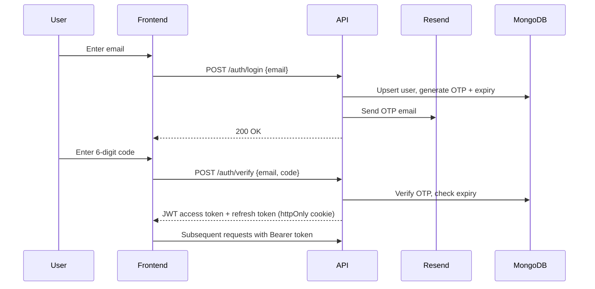
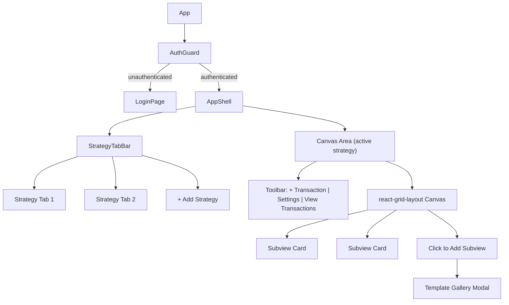

# Strategy-First Investment Tracking App

## Current Project State

**Completed:** Phases 1-5 (frontend scaffold, tabs, canvas, gallery, subview editor/rendering) and Phases 9-12 (backend scaffold, API, frontend-backend integration, EODHD market data).

**The app today:** A working full-stack app where users create strategy tabs, each with a drag-and-drop canvas of subview cards. Subviews are authored as JSON + Python specs and rendered via a generic layout engine + Pyodide. The backend (NestJS + MongoDB) provides CRUD for strategies, transactions, wallets, instruments, and market data via EODHD. SnapTrade integration allows connecting brokerage accounts (OAuth) and syncing transactions into strategies. Frontend uses TanStack Query for all server state.

**Not yet implemented:**
- Phase 7: Transaction UI (add/edit form modal, transaction list)
- Phase 8: Global settings UI (viewing currency, theme panel)
- Phase 13: Auth — implemented (register with email+password, 6-digit verification, sign-in with 2FA, JWT 12h)
- Phase 14: Deployment

**Known tech debt:**
- `useStrategyPrices` uses raw `useEffect` + `fetch` instead of React Query, causing duplicate quote requests across SubviewCards. Should be refactored to use `useQuotes`.

---

## Rules & Conventions

### Architecture Rules

1. **Monorepo** -- npm workspaces: `apps/web` (Vite+React), `apps/api` (NestJS), `packages/shared` (shared types). Single `run.sh` starts both.
2. **API prefix** -- All backend routes use global prefix `/api` (set in `main.ts`). Endpoint examples in this doc omit the prefix for brevity (e.g. `GET /strategies` = `GET /api/strategies`).
3. **Market data provider** -- **EODHD** (stocks/ETFs) — env var: `EODHD_API_TOKEN`. Provider: `apps/api/src/market-data/providers/eodhd-provider.ts`. **Massive** (options, via Polygon.io) — env var: `MASSIVE_API_KEY`. Provider: `apps/api/src/market-data/providers/massive-provider.ts`.
4. **SnapTrade** — Brokerage OAuth integration. Env: `SNAPTRADE_CLIENT_ID`, `SNAPTRADE_CLIENT_SECRET`. Synced strategies are read-only (transactions from SnapTrade cannot be edited). `apps/api/src/snaptrade/`.
5. **SnapTrade transaction types** — Use the original transaction type from SnapTrade. Standard SnapTrade types (BUY, SELL, etc.) are normalized via `ACTIVITY_TYPE_MAP`; brokerage-native types (e.g. `FUNDS_CONVERSION`) are preserved as returned (lowercased).
6. **Auth (current)** -- No real auth. `UserIdMiddleware` reads `x-user-id` header, falls back to `'default-user'`. JWT/OTP planned (Phase 13).

### Subview System Rules

7. **Generic rendering** -- The layout engine, Pyodide executor, and content renderer have zero subview-specific branching. All behavior is driven by JSON + Python. Never add subview-specific logic to the renderer.
8. **Two types only** -- `"readonly"` (display only, no actions, no side effects) and `"readwrite"` (actions allowed, official/premade only).
8. **Inputs not auto-rendered** -- Place inputs in layout via `{ "input": { "ref": "key" } }`. The `ref` must match a key in `spec.inputs`.
9. **Function calling convention** -- `py:` prefix for Python calls in JSON (e.g. `"py:calc_win_rate"`). Without `py:` = literal value.
10. **Python rules** -- Functions accept `(context, inputs)`, return serializable values, no I/O. `context.transactions` has resolved instrument data (`instrumentSymbol`, `instrumentName`). `context.wallet` has wallet. `context.currentPrices` has live prices. `context.priceHistory` has historical EOD prices.
11. **Strategy-scoped inputs** -- Referenced as `global.<id>` in layout. In Python: `inputs.global['<id>']`. Subview-own inputs: `inputs['<key>']`.
12. **Subview top bar inputs** -- Add `topbar: number` to input config to show in card top bar. Lower values = further left. `topbarShowTitle: false` hides label.
13. **Shared renderer** -- Editor Live Preview and canvas SubviewCard share the same layout engine, Pyodide executor, and content renderer (`SubviewSpecRenderer`). Changes to one must update both `SubviewCard` and `LivePreview`.
14. **Official vs user subviews** -- Official (`maker: "official"`): readonly + readwrite templates. User-created: readonly only (readwrite remains official-only).

### Canvas / Grid Rules

15. **Grid config** (`canvas-grid-config.ts`) -- 48 columns, 5px row height, 12px margins. Reference width: 1200px. Optimized canvas width: 1400px.
16. **Layout constraints** -- minW: 4, minH: 7, maxW: 48, maxH: 80 grid units.
17. **Sizes in pixels** -- `defaultSize` and `preferredSize` in subview spec are absolute pixels. Conversion via `pixelsToGrid()` / `gridToPixels()`.
18. **Layout change guard** -- `onLayoutChange` only calls `batchUpdatePositions` when layout actually changes (via `layoutsEqual`), preventing spurious PATCH on mount.

### Color System Rules

19. **Built-in color system only** -- Use built-in names (e.g. `green-2`, `red-1`, `grey-4`) in subview content, gauges, dynamic text. Python helpers return built-in names, not hex. Resolved via `resolveColor()`.
19. **12 main colors, 5 variants each** -- red, orange, yellow, lime, green, mint, cyan, blue, violet, magenta, grey, offwhite. Variants: `-0` (lightest), `-1` (lighter), `-2` (base), `-3` (darker), `-4` (darkest). Plus `black` (#131313), `offblack` (#202020), `white` (#f2f2f2) with no variants.
21. **Branding green** -- `green-2` (#28c207) is the accent/branding color. `green-3` for hover.
22. **Custom colors allowed** -- `resolveColor()` passes through `rgb()`, `rgba()`, `hsl()`, `hsla()`, and `#hex` values.

### Cache-Control TTL Rules

23. **Four TTL levels** -- Apply per endpoint based on data change frequency:
    - **short** = 1 min (`max-age=60`) -- live data (quotes)
    - **medium** = 15 min (`max-age=900`) -- semi-frequent updates
    - **long** = 1 hour (`max-age=3600`) -- stable data (history, margin-requirements)
    - **extra-long** = 12 hours (`max-age=43200`) -- rarely changing data
24. **React Query must match** -- `staleTime` and `refetchInterval` (in ms) should match the server-side TTL.

### UI Design Rules

25. **Design tokens** (from `apps/web/src/index.css`) -- All UI must use existing CSS variables:
    - Spacing: `--space-modal` (20px), `--space-gap` (8px), `--space-section` (24px), `--space-sidebar` (16px)
    - Controls: `--control-height` (32px)
    - Radii: `--radius-card` (8px), `--radius-medium` (6px), `--radius-button` (8px), `--radius-pill` (9999px)
    - Typography: label 11px, body 13px, title 15px, heading 18px, display 24px, xxl 32px, xxxl 40px
26. **Subview card constants** -- `--subview-card-padding: 5px`, `--subview-top-bar-height: 40px`. Top bar: drag handle + title (truncate 150px), pencil icon 8x8 marginRight 5px. Content: `paddingTop` = top bar height, `paddingLeft/Right: 10px`.
27. **Input widths (px)** -- `time_range: 240`, `ticker_selector: 100`, `number_input: 120`, `select: 200`, `checkbox: 120` (fallback 160).
28. **Dark mode only (current)** -- `applyTheme()` removes `light` class. Theme customization in Zustand + localStorage.
29. **Design language** -- Dark background (#131313), floating cards, large border-radius, subtle box-shadows, monochromatic palette, green/red only for financial indicators, generous whitespace, system sans-serif font.

### Data Flow Rules

30. **Context pipeline** -- `SubviewCard` assembles context: `strategy`, `transactions`, `currentPrices` (from `useStrategyPrices`), `instrumentMarginReqs`, `priceHistory` (from `usePriceHistory` batch API). All injected into Pyodide as `context`.
31. **Batch APIs** -- Quotes: `GET /market-data/quotes?symbols=...`. History: `GET /market-data/history?symbols=...&from=&to=`. Option quotes: `GET /market-data/options/quote?contracts=...`.

### Tooling Rules

32. **Tailwind CSS** for styling, **shadcn/ui** for component primitives.
33. **Recharts** for charts.
34. **Zustand** for client state, **TanStack Query** for server state.
35. **Pyodide** for Python in browser. No backend Python.
36. **Mongoose** for MongoDB ODM.

---

## Monorepo Structure

```
STR/
├── packages/
│   └── shared/                  # Shared TypeScript types, enums, constants
│       ├── src/
│       │   ├── models/          # Strategy, Transaction, Instrument, Wallet, Subview types
│       │   ├── enums/           # TransactionType, AssetType, CacheStatus, etc.
│       │   ├── dto/             # Request/response DTOs shared between FE/BE
│       │   └── subview-templates/# Read-only subview template schemas and types
│       ├── package.json
│       └── tsconfig.json
├── apps/
│   ├── web/                     # Vite + React + TypeScript
│   │   ├── src/
│   │   │   ├── api/             # API client (TanStack Query hooks, market-data-api, etc.)
│   │   │   ├── components/      # Shared UI components
│   │   │   ├── features/
│   │   │   │   ├── auth/        # Login, OTP verification pages (planned)
│   │   │   │   ├── strategy/    # Tab bar, strategy settings
│   │   │   │   ├── canvas/      # react-grid-layout canvas, subview cards
│   │   │   │   ├── transactions/# Transaction list, add/edit forms
│   │   │   │   └── subviews/    # Subview Editor, renderer, gallery, JSON templates
│   │   │   ├── hooks/           # Custom hooks (useStrategyPrices, etc.)
│   │   │   ├── store/           # Zustand stores (strategies, theme, UI state)
│   │   │   ├── lib/             # Pyodide executor, price-service, utils
│   │   │   └── App.tsx
│   │   ├── package.json
│   │   ├── vite.config.ts
│   │   └── tsconfig.json
│   └── api/                     # NestJS backend
│       ├── src/
│       │   ├── strategies/      # StrategyModule: CRUD, subview management
│       │   ├── transactions/    # TransactionModule: CRUD, version bumping
│       │   ├── snaptrade/       # SnaptradeModule: registration, connect portal, connections, sync
│       │   ├── instruments/     # InstrumentModule: CRUD, margin-requirements
│       │   ├── wallets/         # WalletModule: CRUD per strategy
│       │   ├── market-data/     # MarketDataModule: EODHD (stocks), Massive (options), MongoDB cache
│       │   ├── common/          # UserIdMiddleware, RequestLoggerMiddleware
│       │   └── main.ts
│       ├── package.json
│       ├── tsconfig.json
│       └── nest-cli.json
├── package.json                 # npm workspaces root
├── tsconfig.base.json           # Shared TS config
├── run.sh                       # Single script to start both frontend + backend
├── subviews.md                  # Full subview JSON+Python spec
└── plan.md                      # This file
```

**Environment variables** (`apps/api/.env`):
- `MONGODB_URI` -- MongoDB Atlas connection string
- `PORT` -- API port (default 3001)
- `EODHD_API_TOKEN` -- EODHD market data API token (stocks/ETFs)
- `MASSIVE_API_KEY` -- Massive/Polygon.io API key (option quotes)
- `SNAPTRADE_CLIENT_ID` -- SnapTrade app client ID
- `SNAPTRADE_CLIENT_SECRET` -- SnapTrade app secret
- `JWT_SECRET` -- Secret for JWT signing
- `JWT_EXPIRES_IN` -- Token expiry (default 12h)
- `RESEND_API_KEY` -- Resend API key for transactional email
- `EMAIL_FROM` -- From address (default signal@opticanvas.com)

---

## 1. Authentication System (Planned -- Phase 13)

**Flow:**


```mermaid
sequenceDiagram
    participant User
    participant Frontend
    participant API
    participant Resend
    participant MongoDB

    User->>Frontend: Enter email
    Frontend->>API: POST /auth/login {email}
    API->>MongoDB: Upsert user, generate OTP + expiry
    API->>Resend: Send OTP email
    API-->>Frontend: 200 OK
    User->>Frontend: Enter 6-digit code
    Frontend->>API: POST /auth/verify {email, code}
    API->>MongoDB: Verify OTP, check expiry
    API-->>Frontend: JWT access token + refresh token (httpOnly cookie)
    Frontend->>API: Subsequent requests with Bearer token
```

**Backend:** `AuthModule` with OTP in User doc (10 min expiry), rate limiting (`@nestjs/throttler`), JWT via `passport-jwt`, access token (15 min) + refresh token (7 days, httpOnly cookie), `JwtAuthGuard` globally with `@Public()` decorator.

**Frontend:** Login page (email -> OTP two-step), access token in memory (Zustand), refresh in httpOnly cookie, axios interceptor for auto-refresh on 401.

---

## 2. Database Models (Mongoose Schemas)

**Strategy** (`strategies` collection):

- `userId` (string, indexed), `name`, `baseCurrency` (default 'USD'), `icon`
- `initialBalance` (number, default 0), `marginAccountEnabled`, `collateralEnabled`
- `loanInterest`, `marginRequirement`, `collateralSecurities`, `collateralCash`, `collateralRequirement`
- `inputs` (embedded array of `StrategyInputConfig`: id, title, type, default, options, min, max)
- `inputValues` (Mixed, default {})
- `transactionsVersion` (number, default 0)
- `subviews` (embedded array of SubviewDoc)
- `mode` ('manual' | 'synced') — manual = user-entered transactions; synced = SnapTrade sync
- `snaptradeConfig` (optional, embedded: `accountIds`, `transactionTypes`) — for synced strategies
- `lastSyncedAt` (optional Date)

**SubviewDoc** (embedded in Strategy):

- `id`, `name`, `position` ({x, y, w, h}), `templateId`, `spec` (Mixed -- full JSON subview spec)
- `icon`, `iconColor`, `inputValues` (Mixed)
- `cacheData` (Mixed), `cachedAt`, `cacheVersion` (default 0), `cacheStatus` (default 'invalid')

**Wallet** (`wallets` collection):

- `strategyId` (string, unique, indexed), `baseCurrency` (default 'USD')
- `initialBalance` (default 0), `marginAccountEnabled`, `collateralEnabled`
- `loanInterest`, `marginRequirement`, `collateralSecurities`, `collateralCash`, `collateralRequirement`

**Transaction** (`transactions` collection):

- `strategyId` (indexed), `userId`, `instrumentId`, `instrumentSymbol`
- `side` (string: buy, sell, dividend, deposit, withdrawal, fee, interest, tax, transfer, split, adjustment, option_exercise, option_assign, option_expire), `quantity`, `price`, `cashDelta`, `currency`, `timestamp`
- `option` ({expiration, strike, callPut, contracts}), `customData` (Mixed)
- `source` ('manual' | 'snaptrade'), `snaptradeActivityId` (for dedup), `accountTransactionId` (for account-to-strategy dedup), `readonly` (synced txs cannot be edited)
- `createdAt`, `updatedAt`

**Instrument** (`instruments` collection):

- `symbol` (indexed), `name`, `assetType`, `currency`, `exchange`
- `marginRequirement`, `contractMetadata` (Mixed)

**SnaptradeConnection** (`snaptrade_connections` collection):

- `userId` (indexed), `authorizationId` (unique per user), `institutionName`, `status`
- `accounts` (embedded array: accountId, name, number, currency, type, balanceAmount, etc.)

**SyncedAccount** (`synced_accounts` collection):

- `userId` (indexed), `accountId` (SnapTrade account ID, unique per user)
- `authorizationId`, `institutionName`, `currency`
- `rebuiltAt` (Date | null), `lastSyncedAt` (Date | null)
- `currentHoldings` (embedded array: symbol, quantity, averagePrice, currency)
- `currentCash` (number)
- `adjustedTransactions` (embedded array of AdjustedTransaction: side, quantity, price, cashDelta, currency, timestamp, instrumentSymbol, option, snaptradeActivityId, synthetic)

---

## 3. Backend API Endpoints

All routes prefixed with `/api`.

**Strategies:**

- `GET /strategies` -- list user's strategies
- `POST /strategies` -- create strategy
- `PATCH /strategies/:id` -- update strategy fields
- `DELETE /strategies/:id` -- delete strategy
- `POST /strategies/:id/subviews` -- add subview
- `PATCH /strategies/:id/subviews` -- batch update subview positions
- `PATCH /strategies/:id/subviews/:subviewId` -- update single subview
- `DELETE /strategies/:id/subviews/:subviewId` -- remove subview
- `PUT /strategies/:id/subviews/:subviewId/cache` -- save computed cache

**Transactions:**

- `GET /strategies/:strategyId/transactions` -- list transactions
- `POST /strategies/:strategyId/transactions` -- add (bumps `transactionsVersion`)
- `PATCH /transactions/:id` -- update
- `DELETE /transactions/:id` -- delete (bumps version)

**Instruments:**

- `GET /instruments/search?q=AAPL` -- search/autocomplete
- `GET /instruments/margin-requirements?symbols=AAPL,VOO` -- batch margin reqs (Cache-Control: long)
- `GET /instruments/:id` -- get single instrument
- `POST /instruments` -- upsert instrument

**Wallets:**

- `GET /strategies/:strategyId/wallet` -- get wallet
- `PATCH /strategies/:strategyId/wallet` -- update wallet settings

**SnapTrade:**

- `POST /snaptrade/register` -- register user with SnapTrade (stores snaptradeUserId, snaptradeUserSecret on User)
- `POST /snaptrade/connect` -- return connection portal URL (OAuth flow)
- `GET /snaptrade/connections` -- list user's brokerage connections
- `POST /snaptrade/connections/refresh` -- refresh account list from SnapTrade
- `DELETE /snaptrade/connections/:authorizationId` -- remove connection
- `GET /snaptrade/accounts` -- list accounts across all connections
- `POST /snaptrade/sync/:strategyId` -- sync transactions from selected accounts into strategy (two-step: syncAccount → syncStrategy)
- `GET /snaptrade/accounts/:accountId/transactions` -- view sanitized adjusted transactions for a brokerage account
- `POST /snaptrade/accounts/:accountId/rebuild` -- rebuild account: re-fetch activities + positions from SnapTrade, recompute synthetic transactions, drop all downstream strategy transactions (they get re-copied on next strategy sync)

**Market Data:**

- `GET /market-data/quotes?symbols=AAPL,VOO` -- batch quotes (Cache-Control: short, 1 min)
- `GET /market-data/options/quote?contracts=...` -- option quotes
- `GET /market-data/history?symbols=AAPL,VOO&from=...&to=...` -- batch history (Cache-Control: long, 1 hour)
- `GET /market-data/history/:symbol?from=...&to=...` -- single symbol history (Cache-Control: long)
- `GET /market-data/search?q=...` -- symbol search

**Auth (planned):**

- `POST /auth/login` -- send OTP
- `POST /auth/verify` -- verify OTP, return tokens
- `POST /auth/refresh` -- refresh access token
- `POST /auth/logout` -- clear refresh token

---

## 4. Frontend Architecture

### Core Shell

The app has no dashboard page. The authenticated shell is a **tab bar** (strategies) + **canvas area** as tab content.


```mermaid
flowchart TD
    App --> AuthGuard
    AuthGuard -->|unauthenticated| LoginPage
    AuthGuard -->|authenticated| AppShell
    AppShell --> StrategyTabBar
    AppShell --> ActiveTabContent["Canvas Area (active strategy)"]
    StrategyTabBar --> TabItem1["Strategy Tab 1"]
    StrategyTabBar --> TabItem2["Strategy Tab 2"]
    StrategyTabBar --> AddTabBtn["+  Add Strategy"]
    ActiveTabContent --> Toolbar["Toolbar: + Transaction | Settings | View Transactions"]
    ActiveTabContent --> GridLayout["react-grid-layout Canvas"]
    GridLayout --> SubviewCard1["Subview Card"]
    GridLayout --> SubviewCard2["Subview Card"]
    GridLayout --> EmptySpace["Click to Add Subview"]
    EmptySpace --> SubviewGallery["Template Gallery Modal"]
```

**Layout:** Single page, no routing between strategies. Tab bar across top (empty state: "Create your first strategy" CTA). Canvas fills viewport with toolbar + grid. User menu top-right.

**Routes:** `/login` (auth), `/` (app shell, protected). Modals for: transaction list/form, strategy settings, subview gallery/editor.

### Strategy Tab System

- Add tab: modal with name, base currency, Manual/Synced mode; for Synced: select SnapTrade accounts + transaction types
- Tab switching: loads strategy's subviews into canvas
- Tab context menu: rename, delete (with confirmation)
- State: Zustand `strategies[]`, `activeStrategyId`; TanStack Query `useStrategies()`, `useStrategy(id)`

### Frontend Hooks

- `useQuotes(symbols)` -- batch quotes via React Query (60s stale/refetch)
- `useOptionQuotes(contracts)` -- option quotes via React Query (30 min stale/refetch)
- `usePriceHistory(symbols, from, to)` -- batch history via React Query
- `useStrategyPrices(transactions)` -- extracts stock/ETF symbols, fetches prices (tech debt: uses raw fetch, not React Query)

---

## 5. Subview System (JSON + Python)

See `subviews.md` for the full spec. Summary:

**Two types:** `readonly` (display only) and `readwrite` (actions allowed, official only).

**JSON structure:** `type`, `name`, `description`, `maker`, `defaultSize` (pixels), `inputs` (optional controls), `layout` (2D array of rows/cells with content), `python_code`, `functions`.

**Function calling:** `py:` prefix in content = Python call. Without prefix = literal value.

**Python:** Functions accept `(context, inputs)`. Return serializable values. No I/O. Context includes `transactions` (with resolved instrument data), `wallet`, `currentPrices`, `priceHistory`.

**Readonly restrictions:** No `actions`. Immutable returns. No side effects.

**Readwrite:** Official only. Actions use predefined handlers (`addTransactionModal`, `editTransactionModal`, etc.). Row/header actions in Table content.

---

## 6. Subview Gallery & Editor

**Gallery:** Shows official subviews (readonly + readwrite) and user-created readonly subviews.

**Editor:** Split-panel modal. Left: tabbed editors (JSON, Python, Transactions seed, Wallet seed) with Monaco. Right: Live Preview using the same renderer as canvas cards. Seed data injected for testing. Save validates and persists. Status bar shows validation state.

---

## 7. Subview Rendering and Caching

Editor Live Preview and canvas SubviewCard share the same layout engine, Pyodide executor, and content renderer.

**Readwrite:** Always fresh (no caching).

**Readonly caching:** Staleness check:

```typescript
const isStale =
  subview.cacheStatus === 'invalid' ||
  subview.cacheVersion !== strategy.transactionsVersion ||
  (subview.cachedAt && Date.now() - subview.cachedAt > TTL);
```

Flow: (1) cached + fresh = render from `cacheData`. (2) stale = run Python, render, save cache via `PUT .../cache`.

**Charts:** Line, bar, pie. Python returns data per chart schema in subviews.md.

**Python execution:** Runs in browser via Pyodide. No backend Python service.

---

## 8. Transaction Management

**Add form:** Instrument search (autocomplete), type dropdown, quantity/price/fee, cash delta (auto or override), timestamp (default now), option fields (conditional), metadata JSON editor.

**List view:** Paginated table, sort by date/instrument/type, inline edit, bulk delete, filter by instrument/type/date range, export CSV.

---

## 9. Market Data Integration

**Backend (`MarketDataModule`):**

- **EODHD** (`eodhd-provider.ts`) with `EODHD_API_TOKEN` — stocks/ETFs, history, symbol search
- **Massive** (`massive-provider.ts`) with `MASSIVE_API_KEY` — option quotes (via Polygon.io)
- Provider registry: EODHD for stocks/ETFs, Massive for options
- MongoDB-backed cache (`quote-cache`, `price-history` collections)
- Batch endpoints: quotes, history, option quotes, search

**Frontend usage:**

- `useQuotes(symbols)` -- polls via TanStack Query with 60s stale/refetch (matches server Cache-Control: short)
- `usePriceHistory(symbols, from, to)` -- batch history via single React Query call
- `useStrategyPrices(transactions)` -- extracts symbols, fetches prices for context pipeline

---

## 10. SnapTrade Brokerage Integration

**Purpose:** Connect brokerage accounts via SnapTrade OAuth, sanitize transaction data at the account level, and sync sanitized transactions into strategies.

**Backend (`SnaptradeModule`, `apps/api/src/snaptrade/`):**

- **User registration** — `POST /snaptrade/register` stores `snaptradeUserId`, `snaptradeUserSecret` on User doc
- **Connection portal** — `POST /snaptrade/connect` returns SnapTrade OAuth redirect URL; user links brokerage in embedded iframe (450×600, no top bar)
- **Connections** — List, refresh (fetches accounts from SnapTrade), delete. Closed and CARD/MSB accounts filtered out
- **Account sanitization** — `SyncedAccount` (collection `synced_accounts`) stores per-account sanitized transaction history as an embedded `adjustedTransactions` array. On first sync of any brokerage account, a **rebuild** runs automatically: fetches current positions + cash balance from SnapTrade, diffs against raw transaction history, and inserts synthetic transactions (`synthetic: true`) to fill gaps (in-kind transfers, cash discrepancies). Synthetic transactions use real `side` types (`buy`, `sell`, `deposit`, `withdrawal`). After rebuild, replaying all adjusted transactions from earliest to latest produces the exact current holdings + cash.
- **Manual rebuild** — `POST /snaptrade/accounts/:accountId/rebuild` clears the account's adjusted transactions, re-fetches all activities + positions from SnapTrade, recomputes synthetic transactions, and drops all downstream strategy transactions that originated from this account. Affected strategies get `transactionsVersion` bumped. On next strategy sync or visit, transactions are re-copied from the rebuilt account.
- **Two-step sync** — (1) `syncAccount`: fetch SnapTrade activities → dedup → append to `SyncedAccount.adjustedTransactions`, rebuild if first time. (2) `syncStrategy`: for each configured account, call `syncAccount`, then copy filtered adjusted transactions to strategy (dedup by `accountTransactionId`).

**SnapTrade activity types** — Use original types from SnapTrade. Standard types (BUY, SELL, etc.) are normalized in `ACTIVITY_TYPE_MAP`; brokerage-native types (e.g. `FUNDS_CONVERSION`) pass through as-is (lowercased).

**option_assign / option_exercise / option_expire** — When an option is assigned, exercised, or expired, the option is removed; do not add synthetic option transactions to compensate. For assign/exercise only, the underlying instrument is affected: put assign → shares added; call assign → shares removed; call exercise → shares added; put exercise → shares removed (100 shares per contract). Rebuild must not update optionState when reversing assign/exercise/expire (avoids phantom residuals).

**options_multileg (rolls)** — SnapTrade reports multi-leg option trades as `OPTIONS_MULTILEG` with `units=0`, `price=0`, and only ONE `option_symbol` (the old/closing leg). The `amount` field is the net cash credit/debit. The new/opening leg is absent. Before the standard rebuild reverse-apply, `resolveMultilegChains` traces the full option lifecycle:

1. Iterate raw transactions from latest to earliest, find each `options_multileg`.
2. Build a chain: trace backward through earlier multiligs for the same underlying + call/put type to find the full roll sequence.
3. Find the origin: the original sell-to-open matching the earliest old option in the chain.
4. Find the endpoint: the final holding in current option holdings (same underlying + call/put), or a close transaction (buy/assign/exercise/expire).
5. Expand each multileg into a buy-to-close (old leg, cashDelta=0) + sell-to-open (new leg, cashDelta=multileg amount). The new leg of each multileg is inferred: next multileg's old option, or the final holding for the last multileg.
6. Replace the original multileg + origin sell + close in `doc.adjustedTransactions` with the reconstructed chain.
7. Mark all chain transactions as handled; they are independent from the remaining raw transactions.
8. After all chains are resolved, run the standard reverse-apply rebuild on the remaining transactions.

Example lifecycle: `Sell $60P → Multileg($60P→$57P) → Multileg($57P→$55P) → $55P in holdings` expands to: `sell 1 $60P | buy 1 $60P + sell 1 $57P | buy 1 $57P + sell 1 $55P`.

**Brokerage refresh before rebuild** — `rebuildAccountFull` calls `refreshBrokerageAuthorization` before fetching activities to ensure transaction data is up-to-date (SnapTrade caches transactions and refreshes once daily).

**Strategy config:** `snaptradeConfig.accountIds` (SnapTrade account UUIDs), `snaptradeConfig.transactionTypes` (optional filter). AddStrategyModal: Synced mode, account picker with `displayLabel` (currency/type for duplicates), transaction type multi-select, closed accounts filtered.

**Frontend:** User modal — Connect Brokerage button, connection status, Refresh, disconnect, **Account Transactions** button to view sanitized transactions per brokerage account (with **Rebuild** button per account to re-sync + recompute). AddStrategyModal — Manual/Synced toggle, account + type selection for synced.

---

## 11. Currency Conversion (UI-Only -- Planned)

- **Global setting** -- viewing currency dropdown in app bar, applies to all strategies
- All displayed monetary values go through `convertCurrency(amount, from, to, rates)`
- Exchange rates fetched from backend and cached
- Purely presentational -- stored data always in original currency
- Zustand `viewingCurrency` global, persisted to localStorage

---

## 12. UI Design

**All UI must follow the existing design system** (see `apps/web/src/index.css`).

**Subview Card Styling (constant across canvas + editor):**

- Card constants: `--subview-card-padding: 5px`, `--subview-top-bar-height: 40px`
- Top bar: fixed height, drag handle + title (truncate 150px), pencil icon (8x8, marginRight 5px), padding left 10px right 4px
- Content: `paddingTop` = top bar height, `paddingLeft/Right: 10px`, `overflow-auto`
- Input widths: `time_range: 240`, `ticker_selector: 100`, `number_input: 120`, `select: 200`, `checkbox: 120` (fallback 160)
- Input styling: right-aligned, `paddingLeft/Right: 12`, height `var(--control-height)`, `rounded-[var(--radius-medium)]`
- Input labels: 11px, font-medium, `--color-text-secondary`
- `time_range`: two date inputs side-by-side, `gap-1`
- `ticker_selector`: `<select>` from `context.transactions[].instrumentSymbol` + "all"
- Text/number sizing: xs(11) sm(13) md(15) lg(18) xl(24) xxl(32) xxxl(40)px; optional `bold`, `italic`

**Design language:**

- Dark background (#131313), floating cards (#202020), large border-radius, subtle box-shadows
- Monochromatic palette; green/red only for financial indicators
- Built-in color system via `resolveColor()` -- no hardcoded hex in subview Python
- Dark mode only (current); light mode planned
- Generous whitespace (20-24px card padding)
- System sans-serif font with strong size/weight hierarchy

**Customizable Color Palette:**

Semantic CSS variables (`:root`): `--color-bg-page`, `--color-bg-card`, `--color-bg-hover`, `--color-border`, `--color-shadow`, `--color-text-primary`, `--color-text-secondary`, `--color-accent`, `--color-accent-hover`, `--color-positive`, `--color-negative`, `--color-chart-1` through `--color-chart-5`.

Theme settings panel: override any token via color picker. Custom palette in Zustand + localStorage. Reset per-token or all.

**Tooling:** Tailwind CSS + shadcn/ui. Responsive: desktop-first, collapse columns on tablet/mobile. Animations: Framer Motion.

---

## 13. Running and Deployment

**Local development:**

`./run.sh` starts both servers concurrently:
- Backend: `npm run dev` in `apps/api` (NestJS, port 3001)
- Frontend: `npm run dev` in `apps/web` (Vite, port 5173, proxies `/api` to backend)
- Uses `concurrently`; Ctrl+C stops both

**Production deployment (planned):**

- Build frontend: `npm run build` in `apps/web` -> static files
- Build backend: `npm run build` in `apps/api` -> compiled JS
- Nginx serves static + proxies `/api` to Node
- SSL via Let's Encrypt + Certbot
- Environment variables via `.env` on droplet
